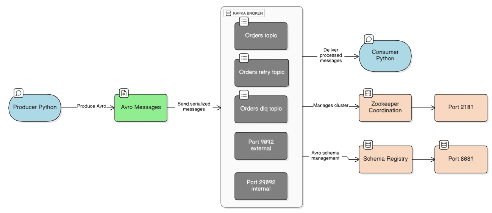

A complete Kafka-based system that produces and consumes order messages with Avro serialization, featuring real-time price aggregation, retry logic, and Dead Letter Queue (DLQ) for failed messages.

## 🎯 Features

Avro Serialization - Messages are serialized using Avro schema for efficient data transfer  
Real-time Aggregation - Running average of order prices calculated in real-time  
Retry Logic - Automatic retry mechanism for temporary failures (configurable max retries)  
Dead Letter Queue - Permanently failed messages sent to DLQ after max retries  
Docker-based Setup - Easy deployment with Docker Compose  
Schema Registry - Centralized schema management with Confluent Schema Registry  

BigDataCode/
├── schemas/
│   └── order.avsc          
├── docker-compose.yml       
├── config.py               
├── producer.py             
├── consumer.py             
├── requirements.txt        
└── README.md              

## System Architecture

## Avro Schema (order.avsc)

{
  "type": "record",
  "name": "Order",
  "namespace": "com.bigdata.orders",
  "fields": [
    {
      "name": "orderId",
      "type": "string",
      "doc": "Unique identifier for the order"
    },
    {
      "name": "product",
      "type": "string",
      "doc": "Name of the purchased item"
    },
    {
      "name": "price",
      "type": "float",
      "doc": "Price of the product"
    }
  ]
}

